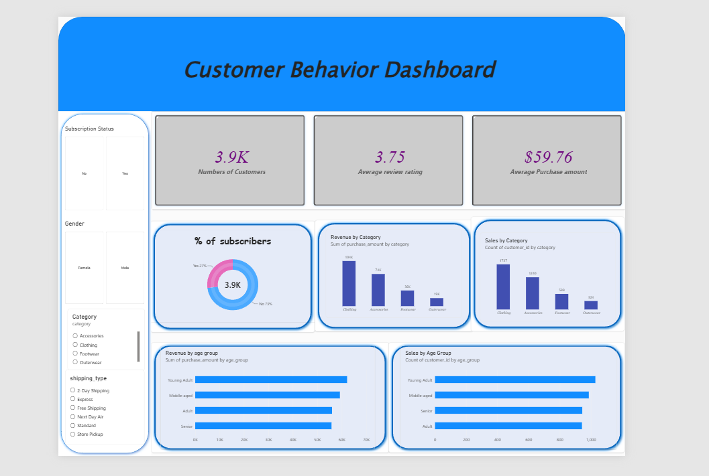

🛍️ Customer Shopping Behavior Analysis
Turning raw retail data into decisions worth making

Python • SQL • Power BI

Show Image Show Image Show Image Show Image

📌 The Problem

A retail company is watching its purchasing patterns shift across demographics, product categories, and sales channels — and needs to know why.

How can the company leverage consumer shopping data to identify trends, improve customer engagement, and optimize marketing and product strategies?

This project answers that question end-to-end: clean the data, interrogate it with SQL, and surface the story in an interactive dashboard.

📸 Dashboard Preview

  

The dashboard surfaces customer count, average review rating, average purchase amount, subscriber split, revenue/sales by category, and revenue/sales by age group — all filterable by subscription status, gender, category, and shipping type.

🧭 Project Workflow
📄 Raw CSVcustomer_shopping_behavior.csv
🧹 Clean & PreparePython / Pandas
🛠️ Feature Engineeringage_group,purchase_frequency_days
🗃️ PostgreSQLSupabase
🔍 SQL Analysis10 business queries
📊 Power BI DashboardCustomerShopping.pbix
📃 Report &Recommendations
Data Pipeline Breakdown
Stage	Tool	What happens
🧹 Prep	pandas	Null handling, column normalization, feature engineering (age_group, purchase_frequency_days)
🗃️ Model	PostgreSQL	Structured schema, 10 targeted business queries
📊 Visualize	Power BI	Interactive dashboard for stakeholder-ready insights
📂 What's Inside
📦 customer_behaviour-_dashboard
├── 🖼️ assets/dashboard-preview.png     → Dashboard screenshot (used in this README)
├── 📓 customerbehavior.ipynb           → Data cleaning & feature engineering
├── 🗄️ sql_queries.sql                  → 10 business-question SQL queries
├── 📊 CustomerShopping.pbix            → Power BI interactive dashboard
├── 📄 customer_shopping_behavior.csv   → ~3,900-row raw retail dataset
├── 📃 Business Problem Document.pdf    → Problem statement & deliverables
├── 📃 Customer Shopping Behavior Analysis.pdf → Full findings report
└── 📜 LICENSE
❓ Questions This Project Answers
💰 Who spends more — male or female customers?
🎯 Which customers used a discount but still spent above average?
⭐ What are the top 5 highest-rated products?
🚚 Standard vs. Express shipping — does it change spend?
🔁 Do subscribers actually spend more than non-subscribers?
🏷️ Which products get discounted most often?
🆕 How many customers are New vs. Returning vs. Loyal?
📦 What are the top 3 products per category?
💳 Are repeat buyers more likely to subscribe?
📈 Which age group drives the most revenue?
🧠 Key Dataset Fields

Age · Gender · Category · Purchase Amount · Season · Review Rating · Subscription Status · Shipping Type · Discount Applied · Previous Purchases · Payment Method · Frequency of Purchases

🚀 Getting Started
bash
# Clone the repo
git clone https://github.com/Nishanttxx/customer_behaviour-_dashboard.git
cd customer_behaviour-_dashboard

# Explore the data prep & feature engineering
jupyter notebook customerbehavior.ipynb

# Run the SQL analysis
psql -f sql_queries.sql

# Open the dashboard
CustomerShopping.pbix   # requires Power BI Desktop
📈 Deliverables
 Cleaned & feature-engineered dataset
 10 SQL business queries
 Interactive Power BI dashboard
 Written analysis report
👤 Author

Nishant Arya GitHub · LinkedIn

Built to turn shopping carts into strategy.

